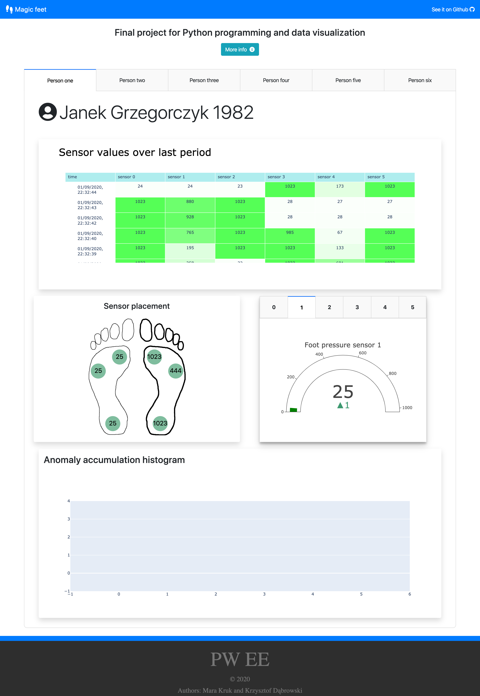

# Foot pressure data visualization

Final project for _Python programming and data visualization_.

## Project goal

Create web application for visualization data from pressure sensors located on patient feet.

## Details

Application will be displaying data collected from 6 people over the period of one hour.  
Data will be accessed through REST api.  
Application will cache latest 10 minutes of data.

## Running the app

App can be started with one command `docker-compose up`, after this go to [localhost:8050](http://localhost:8050).

Docker is required for this method.

## Documentation

Project is described in details in [manual.pdf](./Doc/manual.pdf).

## Project preview

How project looks in action

